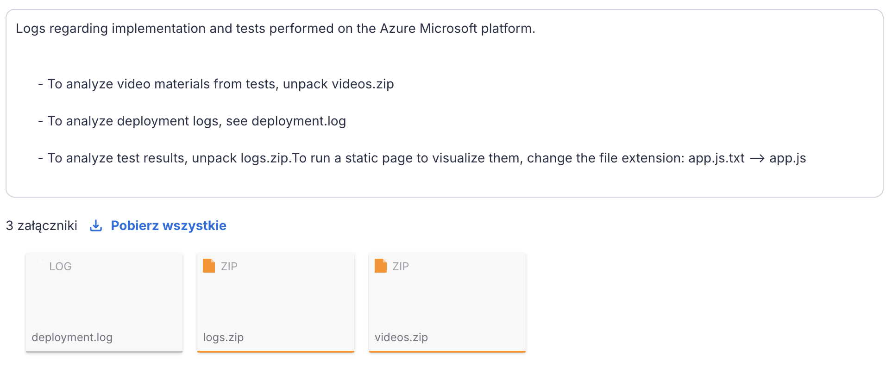
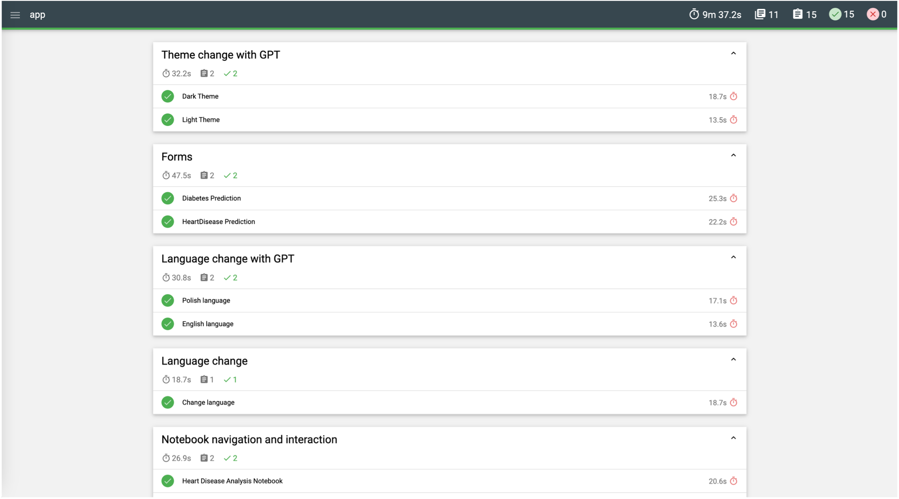

# Medical Prediction - Deployment Guide

To deploy the application locally, you have one options:
- Deploy to Cloud for production environment using Terraform

Below are the details for each method:

---

## 1. Microsoft Azure:

##### 1.0. Prerequisites
```bash
curl -sL https://aka.ms/InstallAzureCLI | bash
az --version
az login
az account show
```
##### 1.1. Environment Variables Setup
Create and configure the `terraform.tfvars` file with your specific values. Here's the template:

**Required variables (must be set):**
```HCL
subscription_id                  =  # Your Azure subscription ID
groq_api_key                     =  # Your Groq API key
duckdns_domain                   =  # Your DuckDNS domain
duckdns_token                    =  # Your DuckDNS token
certificate_pfx                  =  # Your SSL certificate in PFX format
ssl_certificate_password         =  # Password for SSL certificate
ssl_key_base64                   =  # Base64-encoded SSL key
ssl_cert_base64                  =  # Base64-encoded SSL certificate
test_storage_account_name        =  # Storage account name for tests
sender_email                     =  # Email for sending deployment logs
email_password                   =  # Password for sender email
receiver_email                   =  # Email to receive deployment logs
SAS_expiry                       =  # SAS token expiry date
groq_gpt_model                   =  # Groq LLM model
```

**Optional variables (you can use below defaults):**
```HCL
location                        = "eastus2"                              # Azure region for deployment
smtp_server                     = "smtp.gmail.com"                       # SMTP server for email notifications
data_file                       = "Data.json"                            # JSON file with application data
data_file_csv                   = "doctors.csv"                          # CSV file with doctors data
frontend_image                  = "przemek899/medical-frontend:latest"   # Frontend Docker image
backend_image                   = "przemek899/medical-backend:latest"    # Backend Docker image
tests_image                     = "przemek899/medical-tests:latest"      # Tests Docker image
```

*Note: The terraform.tfvars file contains sensitive configuration values that should never be shared.*

##### 1.2. Deployment Execution:

```bash
curl "https://raw.githubusercontent.com/przemek890/NeuroMed-Predict/main/azure/deploy.sh" -o deploy.sh && \
chmod +x deploy.sh && \
./deploy.sh
```

**Access:**
- https://`duckdns_domain`.duckdns.org

## 2. The Deployment Logs and Tests Results

To access the deployment logs and test results, check the mailbox of the email address specified in `terraform.tfvars`. This email will contain:
- Deployment logs
- Static page with test results
- Videos showing the test process





## 3. Rollback the Deployment

To remove all resources after deployment:

```bash
terraform destroy
```
You'll be prompted to confirm the deletion - type `yes` to proceed.

---

## SSL Certificate Setup

You can obtain SSL certificates through Let's Encrypt for 90 days. For detailed setup instructions, see section below:

##### 1.0. Prerequisites

```bash
/bin/bash -c "$(curl -fsSL https://raw.githubusercontent.com/Homebrew/install/HEAD/install.sh)"
brew install certbot
brew install openssl
```

##### 2.0. Generate certificates:
```bash
## DOMAIN e.g. medical-prediction.duckdns.org
sudo certbot --manual --preferred-challenges dns certonly -d <<<DOMAIN>>> --manual-auth-hook ./manual-auth-hook.sh
```

##### 2.0. Base64 encode certificates:
```bash
sudo base64 /etc/letsencrypt/live/<<<DOMAIN>>>/fullchain.pem
sudo base64 /etc/letsencrypt/live/<<<DOMAIN>>>/privkey.pem
```


##### 3.0. Merge certificates for cloud deployment:
```bash
sudo openssl pkcs12 -export -out certificate.pfx \
-inkey /etc/letsencrypt/live/<<<DOMAIN>>>/privkey.pem \
-in /etc/letsencrypt/live/<<<DOMAIN>>>/fullchain.pem
base64 certificate.pfx
```


*Note: During this step, you'll be prompted to set a PFX password*

##### 4.0. Update your `terraform.tfvars` with the generated values:
```hcl
ssl_certificate_password
ssl_key_base64
ssl_cert_base64 
certificate_pfx 
```

---

## How to get other secrets:

- https://portal.azure.com

```hcl
SAS_expiry 
subscription_id  
test_storage_account_name
```

- https://www.duckdns.org

```hcl
duckdns_domain
duckdns_token
```

- https://groq.com

```hcl
groq_api_key
groq_gpt_model 
```

- https://mail.google.com

```hcl
sender_email
email_password 
receiver_email
```
