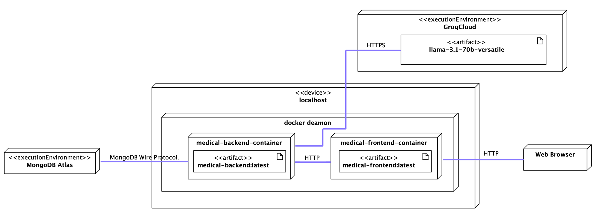

# NeuroMed-Predict

AI-powered medical screening and consultation system using machine learning models and LLMs.

## Key Project Components
1. Cardiovascular risk assessment using MLP architecture
2. Diabetes risk prediction using TabNet with self-attention mechanism
3. LLM model implementation for medical consultations

## System Architecture
- [Local Development Setup](README-LOCAL.md)

- [Cloud Deployment Guide](README-CLOUD.md)

